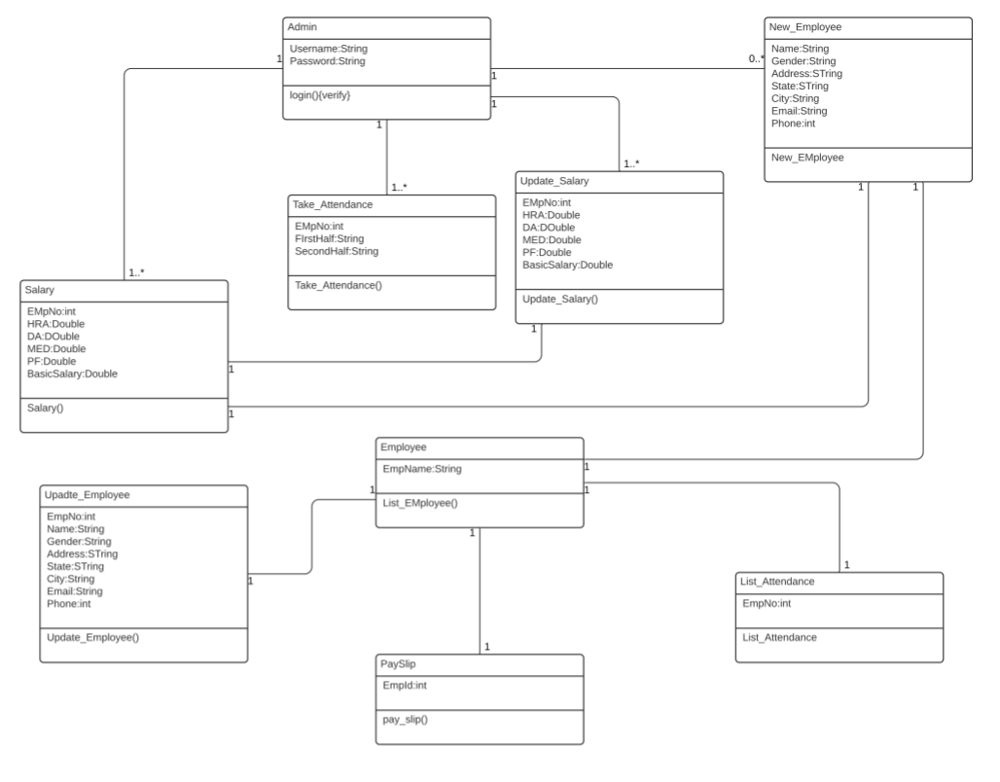

# Payroll-Management-System
## Objective of Payroll Management System
*The main objective of the payroll management system is to provide an easy way out to automate all the functionalities. It manages the details of the employees, calculates their salary, marks attendance. It will manage all the details of the employees and payments. The project is completely built at administrative end and thus only the administrator is guaranteed the access. The purpose of this project is to reduce the manual work.*
### Technology Used
- Java Language
- MySql
### Tools Used
- Ecilipse IDE
- WampServer
## ER-Diagram

---
## Class-Diagram

---

### List of classes
- conn: for establishing the connection with the database
- splash: this is the class from where our main project starts
- login: this class is build for authenticating the administrator and then opening the main interface of the system.
- project: This class contains all the interface of the project. This class can call all the below given classes.
    - New_Employee: for creating the record of new employee.
    - Salary: for inputting the salary of the new employee.
    - List_Employee: for displaying all the employees.
    - TakeAttendence: for taking the attendence of emmployee.
    - ListAttendence: for showing the list of attendence of employees.
    - Pay_slip: for generating the pay-slip of a particular employee.
    - Update-employee: For updating the information of an employee.
    - Update-salary: for updating the salary of an employee.